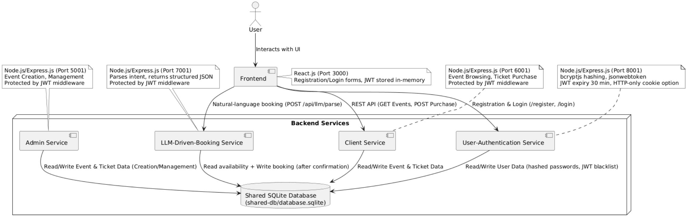

# TigerTickets

A modern, AI-powered event ticketing platform built with microservices architecture, featuring natural language ticket booking powered by Large Language Models (LLM).

## Demo Video


**[Watch the TigerTickets Demo](https://drive.google.com/file/d/1QJDcg7LBqPqLAR79uGD-1RNMYCwTWwRT/view?usp=sharing)**

See TigerTickets in action! This video demonstrates the natural language booking system, event management features, and user authentication flow.

## Quick Start - Run Locally

Get TigerTickets running on your local machine in minutes:

```bash
# 1. Clone the repository
git clone https://github.com/zbourini/tigertickets.git
cd tigertickets

# 2. Install all dependencies
npm run install:all

# 3. Set up environment variables
# Create .env file for LLM service
cd backend/llm-driven-booking
echo "GROQ_API_KEY=your_groq_api_key_here" > .env

# Create .env file for frontend
cd ../../frontend
echo "REACT_APP_BASE_URL=http://localhost:10000" > .env

# 4. Start the backend (Terminal 1)
cd ../backend
npm start

# 5. Start the frontend (Terminal 2 - open a new terminal)
cd frontend
npm start
```

**That's it!** Open http://localhost:3000 in your browser to use TigerTickets.

**Note:** Get your free Groq API key at [console.groq.com](https://console.groq.com/) - required for the LLM booking feature.

## Table of Contents

- [Quick Start - Run Locally](#quick-start---run-locally)
- [Project Overview](#project-overview)
- [Tech Stack](#tech-stack)
- [Architecture](#architecture)
- [Installation & Setup](#installation--setup)
- [Environment Variables](#environment-variables)
- [Running the Application](#running-the-application)
- [Running Tests](#running-tests)
- [Team](#team)
- [License](#license)

## Project Overview

TigerTickets is an innovative event ticketing system that allows users to search and book tickets using natural language. Built with a microservices architecture, the platform features separate services for admin operations, client interactions, user authentication, and LLM-driven booking capabilities.

### Key Features

- **Natural Language Booking**: Book tickets using conversational language powered by AI
- **Event Management**: Admin interface for creating and managing events
- **User Authentication**: Secure user registration and login system
- **Real-time Updates**: Live ticket availability tracking
- **Modern UI**: Responsive React-based frontend with intuitive design
- **Comprehensive Testing**: Full test coverage with unit, integration, and E2E tests

## Tech Stack

### Frontend
- **React** (v19.2.0) - UI framework
- **React Context API** - State management
- **CSS3** - Styling
- **Jest & React Testing Library** - Testing

### Backend
- **Node.js** - Runtime environment
- **Express.js** (v5.x) - Web framework
- **SQLite3** - Database
- **Groq AI SDK** - LLM integration (Llama models)
- **bcrypt** - Password hashing
- **jsonwebtoken** - JWT implementation library
- **JSON Web Tokens (JWT)** - Authentication
- **Vercel AI SDK** - AI streaming and tools
- **cors** - Cross-origin resource sharing
- **Jest & Supertest** - Testing
- **Concurrently** - Multi-service orchestration

### DevOps & Tools
- **Git & GitHub** - Version control
- **GitHub Actions** - CI/CD
- **Vercel** - Frontend deployment
- **Render** - Backend deployment
- **npm** - Package management
- **dotenv** - Environment configuration

## Architecture

TigerTickets follows a **microservices architecture** with a unified backend gateway that routes to four specialized services:



### Data Flow

1. **User Request**: Frontend sends HTTP request to backend gateway
2. **Gateway Routing**: Backend gateway routes request to appropriate microservice via `/api/*` endpoints
3. **Service Processing**: Microservice handles business logic via controllers
4. **Database Operations**: Models interact with shared SQLite database
5. **LLM Integration**: LLM service processes natural language using Groq AI
6. **Response**: Structured JSON response sent back through gateway to frontend
7. **UI Update**: React components re-render with new data

### Microservices

- **Admin Service**: Event creation, updates, deletion (via `/api/admin`)
- **Client Service**: Event browsing, ticket availability (via `/api/client`)
- **Auth Service**: User registration, login, JWT tokens (via `/api/auth`)
- **LLM Booking Service**: Natural language processing, AI-powered booking (via `/api/llm`)

### Deployment Architecture

- **Frontend**: Deployed on **Vercel** (https://tigertickets.vercel.app)
- **Backend Gateway**: Deployed on **Render** (Port 10000)
- **Database**: SQLite with persistent storage on Render
  - **Note**: Render's free tier may reset the database on redeployment. Consider upgrading for persistent disk storage or migrating to PostgreSQL for production use.
- **CI/CD**: GitHub Actions for automated testing on push/PR

### Port Configuration

| Service | Port | URL |
|---------|------|-----|
| Backend Gateway | 10000 | http://localhost:10000 |
| Frontend | 3000 | http://localhost:3000 |

## Installation & Setup

### Prerequisites

- **Node.js** (v16 or higher)
- **npm** (v7 or higher)
- **Git**

### Step 1: Clone the Repository

```bash
git clone https://github.com/zbourini/tigertickets.git
cd tigertickets
```

### Step 2: Install Dependencies

Install all dependencies for frontend and backend services:

```bash
npm run install:all
```

This command will:
1. Install root dependencies
2. Install backend gateway dependencies
3. Install all microservice dependencies (admin, client, auth, LLM)
4. Install frontend dependencies

### Step 3: Initialize the Database

The database will be automatically created when you first run the backend services. The schema is defined in `backend/shared-db/init.sql` and includes:

- **Events table**: Stores event information
- **Users table**: Stores user authentication data
- Sample data for testing

## Environment Variables

### Backend - LLM Service

Create a `.env` file in `backend/llm-driven-booking/`:

```env
# Groq API Configuration
GROQ_API_KEY=your_groq_api_key_here
```

**How to get your Groq API Key:**
1. Visit [Groq Console](https://console.groq.com/)
2. Sign up or log in
3. Navigate to API Keys section
4. Generate a new API key
5. Copy and paste into your `.env` file

### Backend - Authentication Service

Create environment variables for JWT (can be added to `.env` in `backend/user-authentication/`):

```env
# JWT Configuration
JWT_SECRET=your_secure_random_string_here
```

**How to generate a secure JWT secret:**
```bash
# Using Node.js
node -e "console.log(require('crypto').randomBytes(32).toString('hex'))"
```

### Frontend

Create a `.env` file in `frontend/` (or copy from `.env.example`):

```env
# Backend API Base URL
REACT_APP_BASE_URL=http://localhost:10000
```

**Production Environment Variables:**
- Frontend (Vercel): `REACT_APP_BASE_URL` should point to your Render backend URL
- Backend (Render): `GROQ_API_KEY` configured in Render environment settings

## Running the Application

### Development Mode

#### Start Backend Gateway

From the `backend` directory:

```bash
cd backend
npm start
```

This starts the backend gateway on **port 10000** with all microservices embedded:
- Backend Gateway: http://localhost:10000
  - Admin API: http://localhost:10000/api/admin
  - Client API: http://localhost:10000/api/client
  - Auth API: http://localhost:10000/api/auth
  - LLM API: http://localhost:10000/api/llm

#### Start Frontend

From the `frontend` directory:

```bash
cd frontend
npm start
```

Frontend will be available at: http://localhost:3000

### Quick Start (All Services)

From the root directory:

```bash
# Terminal 1: Start backend
npm run start:backend

# Terminal 2: Start frontend
npm run start:frontend
```

### Production Deployment

The application is deployed with:

- **Frontend**: Vercel (https://tigertickets.vercel.app)
  - Automatic deployments from `master` branch
  - Environment variable: `REACT_APP_BASE_URL` (points to Render backend)

- **Backend**: Render (Port 10000)
  - Unified gateway with embedded microservices
  - Environment variable: `GROQ_API_KEY` (for LLM service)
  - Persistent SQLite database storage
  
- **CI/CD**: GitHub Actions
  - Runs on every push and pull request to `master`
  - Executes all backend and frontend tests
  - Ensures code quality before deployment

## Running Tests

TigerTickets has comprehensive test coverage including unit tests, integration tests, and end-to-end tests.

### Run All Tests

#### Backend Tests

```bash
# From root
npm run test:backend

# Or from backend directory
cd backend
npm test
```

This runs tests for all microservices:
- Admin Service tests
- Client Service tests
- LLM Service tests
- Auth Service tests

#### Frontend Tests

```bash
# From root
npm run test:frontend

# Or from frontend directory
cd frontend
npm test
```

### Run Specific Test Suites

#### Admin Service Tests

```bash
cd backend/admin-service
npm test                    # All tests with coverage
npm run test:unit          # Unit tests only
npm run test:integration   # Integration tests only
```

#### LLM Service Tests

```bash
cd backend/llm-driven-booking
npm test                    # All tests with coverage
npm run test:unit          # Unit tests only
npm run test:integration   # Integration tests only
```

#### Client Service Tests

```bash
cd backend/client-service
npm test
```

### Test Coverage Reports

After running tests, coverage reports are generated in each service's `coverage/` directory:

- **HTML Report**: `coverage/lcov-report/index.html` (open in browser)
- **LCOV**: `coverage/lcov.info`
- **JSON**: `coverage/coverage-final.json`

### Coverage Thresholds

The project maintains high test coverage standards:

- **Backend Services**: 85% lines, 85% statements, 60-85% branches, 100% functions
- **Frontend**: Configurable via Jest settings

### Regression Testing

To ensure code quality and prevent regressions:

1. **Run full test suite before committing**:
   ```bash
   npm run test:backend
   npm run test:frontend
   ```

2. **Check coverage reports** to ensure no drop in coverage

3. **CI/CD Pipeline**: GitHub Actions automatically runs all tests on push/PR

4. **E2E Tests**: Located in `backend/admin-service/__tests__/e2e/`
   ```bash
   cd backend/admin-service
   npm test __tests__/e2e/
   ```

## Team

### Development Team
- **Ahmet Dokmeci** - Developer
- **Zaid Bourini** - Developer

### Academic Team
- **Dr. Julian Brinkley** - Instructor
- **Colt Doster** - Teaching Assistant
- **Atik Enam** - Teaching Assistant

### Institution
Clemson University - Software Engineering 3720

## License

This project is licensed under the **MIT License** - see below for details.

### MIT License

```
MIT License

Copyright (c) 2025 TigerTickets Team (Ahmet Dokmeci, Zaid Bourini)

Permission is hereby granted, free of charge, to any person obtaining a copy
of this software and associated documentation files (the "Software"), to deal
in the Software without restriction, including without limitation the rights
to use, copy, modify, merge, publish, distribute, sublicense, and/or sell
copies of the Software, and to permit persons to whom the Software is
furnished to do so, subject to the following conditions:

The above copyright notice and this permission notice shall be included in all
copies or substantial portions of the Software.

THE SOFTWARE IS PROVIDED "AS IS", WITHOUT WARRANTY OF ANY KIND, EXPRESS OR
IMPLIED, INCLUDING BUT NOT LIMITED TO THE WARRANTIES OF MERCHANTABILITY,
FITNESS FOR A PARTICULAR PURPOSE AND NONINFRINGEMENT. IN NO EVENT SHALL THE
AUTHORS OR COPYRIGHT HOLDERS BE LIABLE FOR ANY CLAIM, DAMAGES OR OTHER
LIABILITY, WHETHER IN AN ACTION OF CONTRACT, TORT OR OTHERWISE, ARISING FROM,
OUT OF OR IN CONNECTION WITH THE SOFTWARE OR THE USE OR OTHER DEALINGS IN THE
SOFTWARE.
```

## Links

- **Live Application**: https://tigertickets.vercel.app
- **Repository**: https://github.com/zbourini/tigertickets
- **Issues**: https://github.com/zbourini/tigertickets/issues

## Contributing

This is an academic project.

---

**Built by the Ahmet Dokmeci & Zaid Bourini at Clemson University**
